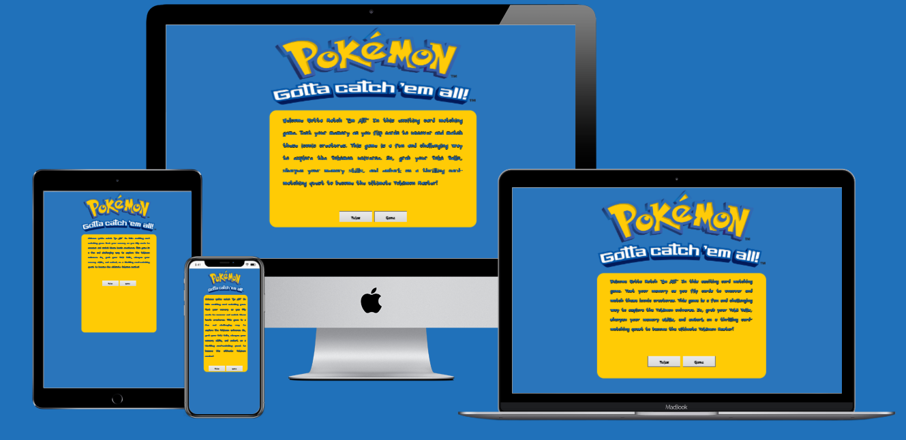

# Gotta Catch'Em All - Card Matching Game

Welcome to **Gotta Catch'Em All**, an exciting card matching game that takes you into the Pokémon universe. Test your memory and match iconic Pokémon cards to become the ultimate Pokémon Master!

## Table of Contents
- [Gotta Catch'Em All - Card Matching Game](#gotta-catchem-all---card-matching-game)
  - [Table of Contents](#table-of-contents)
  - [Introduction](#introduction)
  - [Game Features](#game-features)
    - [Timer](#timer)
    - [Score Tracker](#score-tracker)
    - [Flip Counter](#flip-counter)
    - [Highscore](#highscore)
  - [How to Play](#how-to-play)
  - [Installation](#installation)
  - [Usage](#usage)
  - [Rules](#rules)
  - [Wireframe](#wireframe)
  - [Bugs](#bugs)
    - [Bug 1: Highscore Tracking Issue](#bug-1-highscore-tracking-issue)
    - [Bug 2: File Path Issue](#bug-2-file-path-issue)
    - [Bug 3: Missing Image Issue](#bug-3-missing-image-issue)
  - [Goals](#goals)
    - [Random Elements](#random-elements)
    - [Score Tracker](#score-tracker-1)
    - [Timer](#timer-1)
    - [Event Listeners](#event-listeners)
  - [Credits](#credits)
  - [License](#license)

## Introduction

This is my first project with JavaScript, and I embarked on this journey with some initial challenges. To overcome these difficulties and bring **Gotta Catch'Em All** to life, I relied on online resources, tutorials, and the support of the development community. This project represents not only a valuable learning.

## Game Features

**Gotta Catch'Em All** offers a range of exciting features that enhance your gaming experience:

### Timer
- Keep track of your game time with the built-in timer. The timer counts down from a preset time, adding an element of challenge to the game.
- The timer keeps you engaged and encourages you to complete the game as quickly as possible while finding all the matching pairs.

### Score Tracker
- The game includes a score tracker that counts your moves or "flips." It displays the number of flips you've made during your current game session.
- Challenge yourself to complete the game with the fewest flips possible and achieve a new highscore!

### Flip Counter
- The flip counter provides instant feedback on your gameplay by showing the number of card flips you've made.
- It helps you keep track of your progress and improvement as you aim to reduce the number of flips needed to complete the game.

### Highscore
- The game keeps track of your highscore, which is the lowest number of flips it took you to complete the game. 
- Your highscore will be displayed on the screen, and it will persist even if you close the game.

These features not only make **Gotta Catch'Em All** an enjoyable game but also add an element of competitiveness as you strive to improve your score and time with each playthrough.

## How to Play

1. Click on a card to reveal its image.
2. Click on a second card to see if it matches the first.
3. If the two cards match, they will remain face-up.
4. If they don't match, they will be flipped face-down again.
5. Continue flipping cards to find all the matching pairs.
6. The game ends when all pairs are matched or the timer runs out.

## Installation

1. Clone this repository to your local machine.
2. Open the project folder in your preferred code editor.

## Usage

1. Open the `index.html` file in a web browser to play the game.
2. Click on cards to flip them and find matching pairs.
3. Enjoy the game and try to achieve a highscore!

## Rules

For detailed rules on how to play the game, click the "Rules" button in the game's menu. This will provide you with instructions on how to play and enjoy the game to the fullest.

## Wireframe

1. Index.Html

## Bugs

 ### Bug 1: Highscore Tracking Issue

**Issue**: In the initial version of the game, the highscore was incorrectly tracking the time taken to complete the game instead of the intended behavior, which is to track the number of flips made by the player. This resulted in the highscore displaying the fastest completion time rather than the fewest flips used to complete the game.

**Solution**: To fix this issue, a correction has been made to the game's logic. The highscore now accurately represents the player's performance based on the fewest number of flips used to complete the game. The highscore is stored using local storage, ensuring that it persists even if the game is closed and reopened.

### Bug 2: File Path Issue

**Issue**: There was a bug in the code where a file path contained an extra character, causing issues with loading game assets.

**Solution**: The file path has been corrected, eliminating the extra character to ensure the proper loading of game assets. This fix resolves any issues related to asset loading and ensures a seamless gaming experience.

### Bug 3: Missing Image Issue

**Issue**: There was a bug in the code where an image failed to load due to it being missing from the image file.

**Solution**: The issue was resolved by deleting and re-adding the missing image to the image file. This fix ensured that the required image assets are available, preventing any further loading issues and maintaining the game's visual elements as intended.

If you come across any bugs or issues while playing **Gotta Catch'Em All**, please don't hesitate to report them. Your feedback is valuable in improving the game.

To report a bug, [click here](https://www.linkedin.com/in/victor-da-silva-033399228/) to contact the developer. Alternatively, you can create an issue on the [GitHub repository](https://github.com/CptMundo/Gotta-Catch-Em-All) for this project.

Your help in identifying and resolving bugs is greatly appreciated!

## Goals

**Gotta Catch'Em All** is my first project with JavaScript, and my goals for this project were as follows:

### Random Elements

1. **Random Elements**: Create a game where the arrangement of cards is randomized for each playthrough. This adds an element of unpredictability and replayability to the game.

### Score Tracker

2. **Score Tracker**: Implement a score tracker that counts and displays the number of flips (card turns) made by the player during the game. The goal is to complete the game with as few flips as possible.
   
### Timer

3. **Timer**: Incorporate a timer that starts when the game begins and adds an extra challenge by counting down the time available to complete the game successfully.

### Event Listeners

4. **Event Listeners**: Utilize JavaScript event listeners to enable card flipping and interactivity with the game elements. Event listeners are crucial for player interaction and game logic.

By achieving these goals, I aimed to create a fully functional and enjoyable card matching game that incorporates JavaScript to enhance the user experience.

## Credits

Special thanks to the following individuals and resources who contributed to the development of **Gotta Catch'Em All**:

- [Victor Da Silva](https://www.linkedin.com/in/victor-da-silva-033399228/) - Game Developer
- [FreePng.com](https://freepngimg.com/games/pokemon) - Provided all the images used for the game
- [CodingNepal](https://www.youtube.com/watch?v=DABkhfsBAWw) - I'm grateful for the tutorial that provided valuable insights and guidance, which I creatively applied to develop **Gotta Catch'Em All**
- [BrainStorm](https://brainstation.io/learn/javascript/comment) - Used as a reference for JavaScript implementation
- [CodeInstitute] - I want to express my sincere appreciation to my school for the invaluable tutorials they provided as part of the courses, which greatly contributed to my learning and the development of my skills.

Feel free to update and add to the credits section as you fulfill it with the names and contributions of individuals and resources involved in your project.

## License

This project is licensed under the [MIT License](LICENSE).

---

Enjoy playing **Gotta Catch'Em All** and test your memory skills in the Pokémon universe!
